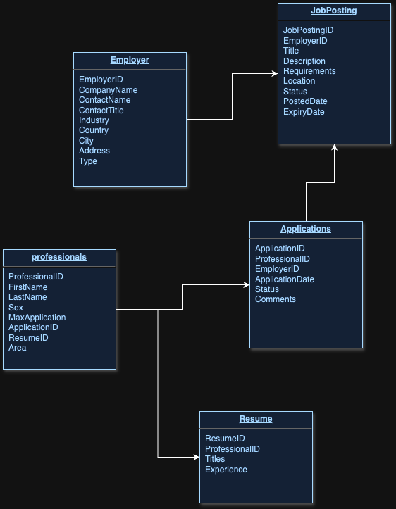
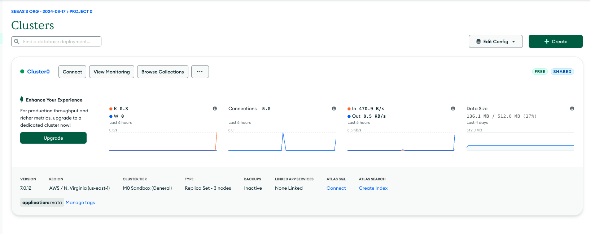
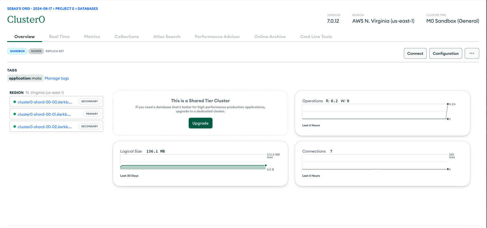
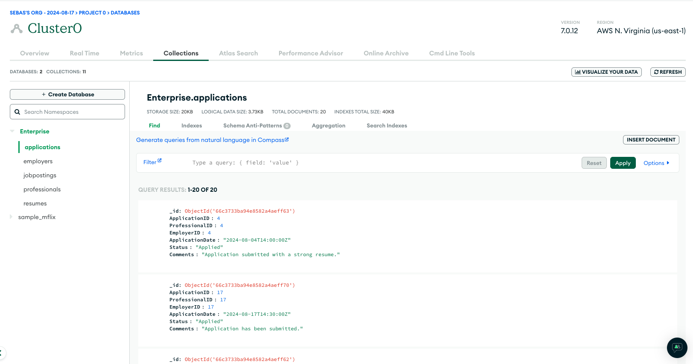

# Final Project for DB

> Please use a mongoDB server, it can be a docker container or any other

```bash
#Initiate project dependencies
npm install
#Start Project
npm run dev
```
# Database Diagram
<p>This is our database proposal, this diagram will make sure that the data will be distributed in a efficient way</p>

<p align="center">
    
</p>

# Mongo Atlas Replication
<p align="center">For the migration method of the database we are using a MongoAtlas database, that automatically make the replication of the data in the secondary clusters that it contain, so in the next image we can see the <b>General Cluster</b> that contains the other clusters.</p> 
<hr>

<h3 align="center">General Cluster</h3>
<p align="center">
    
</p>
<hr>

<h3 align="center">Primary and secondaries clusters</h3>
<p align="center">
    
</p>
<hr>

<h3 align="center">Replicated Information</h3>

<p align="center">
    
</p>

# Testing Querys

<p align="center"><b>Registry of Bidders</p>

```bash
mutation Mutation($employerId: Int!, $companyName: String!, $industry: String!, $country: String!, $city: String!, $address: String!) {
  addEmployer(EmployerID: $employerId, CompanyName: $companyName, Industry: $industry, Country: $country, City: $city, Address: $address) {
    EmployerID
  }
}
```
> Remember to send corresponding data into the *JSON* section, or else the query will not work

<p align="center">Case File Registration</p>

```bash
mutation Mutation($resumeId: Int!, $professionalId: Int!, $titles: [String]!, $experience: [String]!) {
  addResume(ResumeID: $resumeId, ProfessionalID: $professionalId, Titles: $titles, Experience: $experience) {
    ProfessionalID
    ResumeID
  }
}
```
> Remember to send corresponding data into the *JSON* section, or else the query will not work

<p align="center">Job Vacancy Announcement</p>

```bash
query Query {
  allJobPostings {
    Title
    Requirements
    Status
  }
}
```

<p align="center">General Information (employer)</p>

```bash
query AllEmployers {
  allEmployers {
    EmployerID
    ContactName
    CompanyName
    City
    Industry
    JobPostings {
      Description
      Location
    }
  }
}
```

<p align="center">Specific Information (professional)</p>

```bash
query Query($professionalId: Int!) {
  professional(ProfessionalID: $professionalId) {
    FirstName
    LastName
    Resumes {
      Titles
      Experience
    }
    Applications {
      Status
      ApplicationDate
    }
  }
}
```
> Remember to send the professionalID into the *JSON* section, or else the query will not work


<p align="center">Inventory Information of Vacant Positions</p>

```bash
query Query {
  allJobPostings {
    JobPostingID
    Title
    Status
    Requirements
  }
}
```

<p align="center">Name of Applicants for a Specific Area</p>

```bash
query ProfessionalsByArea($area: String!) {
  professionalsByArea(area: $area) {
    FirstName
    LastName
  }
}
```
> Remember to send the area into the *JSON* section, or else the query will not work

<p align="center">Number and Percentage of Registered Professionals by Area</p>

```bash
query Query {
  countProfessionalsByArea {
    area
    count
    percentage
  }
}
```

<p align="center" textColor="#00000"> Number of Registered Professionals by Gender</p>

```bash
query Query {
  countProfessionalsByGender {
    femaleCount
    maleCount
  }
}
```
# Example Images for Querying

<p align="center">Job Vacancy Announcement</p>
<p align="center">Case File Registration</p>
<p align="center">Job Vacancy Announcement</p>
<p align="center">General Information (employer)</p>
<p align="center">Specific Information (professional)</p>
<p align="center">Inventory Information of Vacant Positions</p>
<p align="center">Name of Applicants for a Specific Area</p>
<p align="center">Number and Percentage of Registered Professionals by Area</p>
<p align="center" textColor="#00000"> Number of Registered Professionals by Gender</p>
